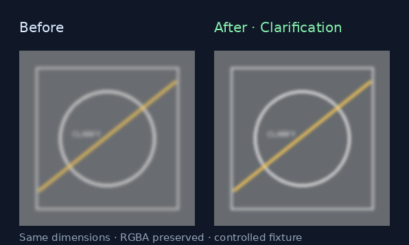
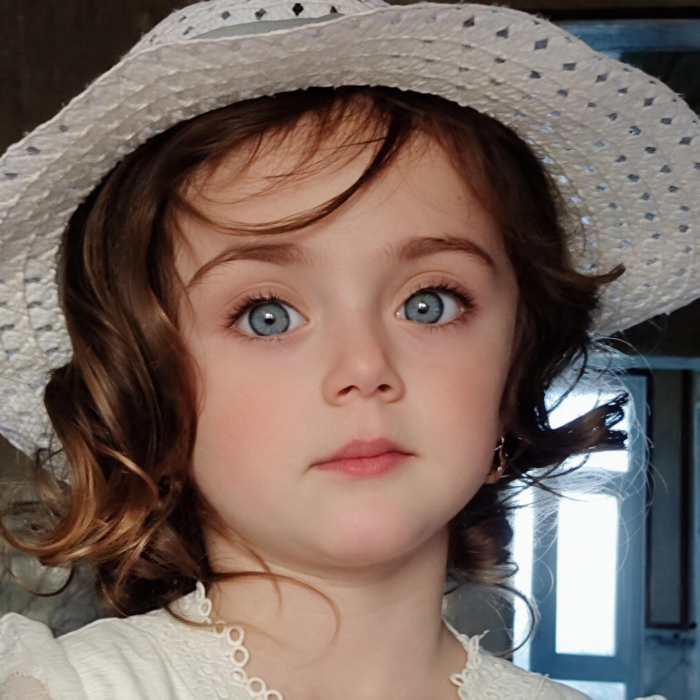
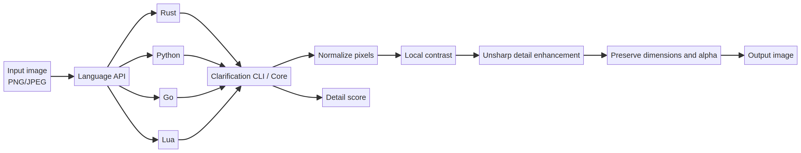

# Clarification

[](https://github.com/source-matrix/Clarification/actions/workflows/ci.yml)
[](https://www.rust-lang.org/)
[](bindings/python)
[](bindings/go)
[](bindings/lua)
[](LICENSE)

**Clarification is a local, cross-language image enhancement toolkit for making soft edges and low-contrast details easier to inspect.** It combines controlled local contrast, unsharp detail enhancement, alpha preservation, and a small comparison score behind one organized project.

The reference implementation is written in Rust. Python can process images in-process through Pillow, while Go and Lua use the portable Clarification CLI. No image is uploaded and no remote service is required.



### Before/after reference

The repository also includes the user-provided reference pair used to calibrate the portrait-oriented profile:

| Before | After reference |
| --- | --- |
|  |  |

See [`docs/assets/before-after/`](docs/assets/before-after/) for the image notes and file details. The pair is a visual reference rather than pixel-perfect ground truth because the source and reference have different dimensions and JPEG encodings.

> Clarification improves the presentation of captured pixels. It cannot recover detail that was never present in the source image, and its output should not be treated as the sole basis for safety-critical, legal, medical, or identity decisions.

## Contents

- [Highlights](#highlights)
- [Architecture](#architecture)
- [Installation](#installation)
- [Quick start](#quick-start)
- [Language support](#language-support)
- [Options](#options)
- [Before/after reference](#beforeafter-reference)
- [Repository layout](#repository-layout)
- [Testing and validation](#testing-and-validation)
- [Performance and scope](#performance-and-scope)
- [Contributing](#contributing)
- [License](#license)

## Highlights

| Capability | Description |
| --- | --- |
| Shared core | Rust implementation with a small, explicit `ClarificationOptions` contract. |
| Four entry points | Direct Rust API, Python/Pillow, Go bridge, and Lua bridge. |
| Practical CLI | `clarify` processes an image; `score` reports a lightweight local-detail metric. |
| Safe defaults | Dimensions are preserved; alpha is restored after RGB enhancement. |
| Local-first | Processing happens on the machine that runs the library. |
| Reproducible checks | A controlled fixture, unit tests, cross-language smoke tests, and CI are included. |
| Portrait profile | `portrait` combines stronger detail enhancement with deterministic 4× Lanczos resizing. |

## Architecture

The same conceptual pipeline is available from every language entry point:



The Rust CLI and core are the compatibility reference. Python avoids a subprocess by using Pillow, while Go and Lua intentionally keep a thin bridge to the CLI so they do not need to duplicate codec and enhancement logic.

For the longer design explanation, read [docs/guides/architecture.md](docs/guides/architecture.md).

## Installation

### Rust CLI and core

Build the workspace with the stable Rust toolchain supported by the project:

```bash
cargo build --release
```

The executable is available at `target/release/clarification`.

### Python

```bash
python -m pip install -e bindings/python
```

The Python binding requires Pillow and exposes `Options`, `clarify`, `clarify_file`, and `sharpness_score`.

### Go

The Go package is a local bridge and has no third-party dependency:

```bash
cd bindings/go
go test ./...
```

Import the package from its module path shown in [bindings/go/go.mod](bindings/go/go.mod), then provide the path to a built Clarification binary.

### Lua

Copy [bindings/lua/clarification.lua](bindings/lua/clarification.lua) into your Lua module path. The module uses `io.popen` and `os.execute` to invoke the CLI and requires a Lua runtime with those standard facilities enabled.

## Quick start

### CLI

```bash
clarification clarify input.png output.png \
  --radius 1.2 \
  --amount 1.35 \
  --contrast 8 \
  --threshold 2

clarification score input.png
clarification score output.png

# Reference-style portrait enhancement: 4× output with tuned detail settings
clarification clarify input.png portrait-output.png --preset portrait
```

### Rust

```rust
use clarification_core::{clarify, ClarificationOptions};
use image::ImageReader;

fn main() -> Result<(), Box<dyn std::error::Error>> {
    let source = ImageReader::open("input.png")?.decode()?;
    let output = clarify(&source, ClarificationOptions::default());
    output.save("output.png")?;
    Ok(())
}
```

### Python

```python
from clarification import Options, clarify_file, sharpness_score

options = Options(amount=1.5, contrast=10.0)
clarify_file("input.png", "output.png", options)
print(f"detail score: {sharpness_score('output.png'):.4f}")
```

### Go

```go
options := clarification.DefaultOptions()
err := clarification.Enhance("target/release/clarification", "input.png", "output.png", options)
if err != nil {
    log.Fatal(err)
}
```

### Lua

```lua
local clarification = require("clarification")
local output, err = clarification.enhance("target/release/clarification", "input.png", "output.png", clarification.defaults())
assert(output, err)
```

Runnable files for each language are in [`examples/`](examples). The concise walkthrough is also available in [docs/guides/quickstart.md](docs/guides/quickstart.md).

## Language support

| Language | Entry point | Processing model | Example |
| --- | --- | --- | --- |
| Rust | `clarification-core` and CLI | In-process core or CLI | [examples/rust](examples/rust) |
| Python | `clarification` | In-process Pillow binding | [examples/python](examples/python) |
| Go | `clarification` | Typed CLI bridge | [examples/go](examples/go) |
| Lua | `clarification.lua` | Lightweight CLI bridge | [examples/lua](examples/lua) |

## Options

| Option | Default | Meaning |
| --- | ---: | --- |
| `radius` | `1.2` | Radius used by the unsharp detail pass. |
| `amount` | `1.35` | Strength of detail enhancement. |
| `contrast` | `8.0` | Percentage added to local contrast. |
| `threshold` | `2` | Minimum local difference considered for sharpening. |
| `scale` | `1.0` | Output scale; values above `1.0` use Lanczos resizing after enhancement. |
| `--preset portrait` | — | Uses `radius=1.0`, `amount=1.65`, `contrast=5.0`, `threshold=1`, and `scale=4.0`. |

The CLI accepts floating-point values for `radius`, `amount`, `contrast`, and `scale`, and clamps `threshold` to the valid byte range. Exact API names and signatures are documented in [docs/guides/api.md](docs/guides/api.md). For Python use `Options.portrait()`, for Go use `PortraitOptions()`, and for Lua use `clarification.portrait()`.

## Before/after reference

The before/after pair in [`docs/assets/before-after/`](docs/assets/before-after/) is included as a reproducible visual reference for the portrait profile. It documents the desired direction of the result but does not claim that deterministic sharpening can reconstruct details absent from a low-resolution input.

## Repository layout

```text
Clarification/
├── .github/workflows/ci.yml      # Cross-language CI
├── crates/
│   ├── clarification-core/       # Rust image-processing core
│   └── clarification-cli/        # `clarify` and `score` commands
├── bindings/
│   ├── python/                   # Pillow binding and Python module CLI
│   ├── go/                       # Typed Go CLI bridge
│   └── lua/                      # Lua module bridge
├── examples/                     # Runnable Rust, Python, Go, and Lua examples
├── tests/                        # Fixtures, unit tests, and smoke tests
├── docs/
│   ├── assets/                   # Architecture and before/after visuals
│   │   └── before-after/          # User-provided portrait reference pair
│   └── guides/                   # API, architecture, validation, and quick start
├── scripts/                      # Reproducible documentation-asset generation
├── Cargo.toml
├── README.md
├── CHANGELOG.md
├── CONTRIBUTING.md
├── SECURITY.md
└── LICENSE
```

## Testing and validation

Run the complete local checks:

```bash
cargo fmt --all -- --check
cargo test --workspace
PYTHONPATH=bindings/python python -m unittest discover -s tests/python -v
(cd bindings/go && test -z "$(gofmt -l .)" && go test ./...)
LUA_PATH="$(pwd)/bindings/lua/?.lua;;" lua5.4 tests/lua_smoke.lua
```

The controlled fixture in `tests/fixtures/input.png` produced a measurable local-detail increase in the release CLI validation. See [docs/guides/validation.md](docs/guides/validation.md) for the recorded result and its limitations.

## Performance and scope

Clarification is designed as a compact local enhancement layer, not as a full super-resolution or forensic reconstruction system. Processing cost depends on image dimensions and codec behavior. For batch workloads, reuse the process where the language binding permits it, keep input/output formats explicit, and benchmark on representative images rather than relying on the fixture alone.

## Contributing

Read [CONTRIBUTING.md](CONTRIBUTING.md) before opening a pull request. New operations should document their effect on edges, color, alpha, memory, and runtime behavior, and should include a regression test.

## License

Clarification is released under the [MIT License](LICENSE).

## Project structure inspiration

The navigation-first README organization, quick-start emphasis, architecture section, examples-first presentation, and explicit limitations are inspired by the public structure of [FLEX-GHOST/rusttgcalls][1]. Clarification does not copy its text, code, branding, or domain-specific implementation.

## References

[1]: https://github.com/FLEX-GHOST/rusttgcalls "FLEX-GHOST/rusttgcalls"
